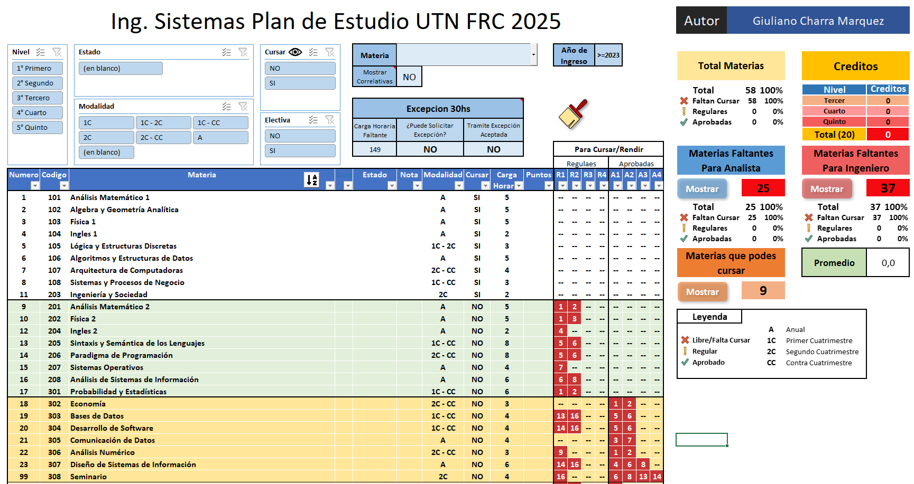
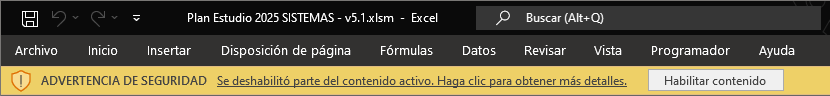
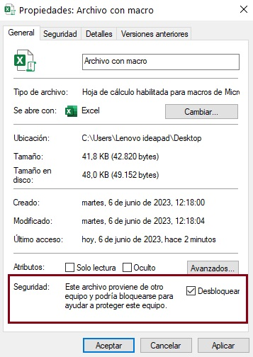

# 🚀 Planes de Estudio UTN FRC Interactivos (2025) 📚

---

## ✨ ¡Bienvenido/a a PlanEstudiosUTN! ✨

Este proyecto, **PlanEstudiosUTN**, es una iniciativa **personal y no oficial** creada por **Giuliano Benicio Charra Marquez** de la **Universidad Tecnológica Nacional - Facultad Regional Córdoba (UTN FRC)**.

> [!Caution]
> 🚨 **Atención:** Este proyecto **_NO_** es una herramienta oficial de la UTN FRC.
>
> Es una iniciativa **independiente** destinada a ayudarte a visualizar y gestionar tu avance académico de manera más fácil e interactiva.
>
> Consulta siempre las **fuentes oficiales** para información académica actualizada.

> [!NOTE]
> ℹ️ **Nota:** Los archivos de PlanEstudiosUTN fueron elaborados utilizando planes disponibles públicamente.
>
> Aunque se ha puesto el mayor esfuerzo en asegurar su exactitud, **pueden existir errores**.  
> ¡Cualquier sugerencia o corrección es muy bienvenida para seguir mejorando esta herramienta!

---

## 🎯 ¿Cuál es el Objetivo?

**PlanEstudiosUTN** busca simplificar la gestión de tu carrera universitaria, permitiéndote:

- ✅ **Visualizar tu Avance:** Obtén una panorámica clara de tu progreso en la carrera.
- 🎓 **Gestionar tus Materias:** Realiza un seguimiento efectivo de materias aprobadas, regulares y pendientes.
- 🔗 **Entender las Correlatividades:** Visualiza fácilmente los requisitos para cursar cada materia y planifica estratégicamente tu cursada.

> **En resumen:** ¡Planifica tu carrera de Ingeniería en la UTN FRC de forma más inteligente y visual!

---

## 🖼️ Vista previa del Plan de Estudios

  

---

## ✨ Funcionalidades Principales ✨

Los archivos Excel **PlanEstudiosUTN (.xlsm)**, habilitados con macros, ofrecen algunas funcionalidades:

### 📊 Visualización Interactiva y Clara del Plan de Estudios:

- **Carrera Específica:** Cada archivo Excel corresponde a una carrera y plan de estudios de la UTN FRC.

- **Tabla de Materias Detallada:**  
  Listado completo de materias con:

  - Código
  - Nombre
  - Estado visualizado por íconos:
    - **🟩 Aprobado:** Materia aprobada (bandera verde).
    - **🟨 Regular:** Materia regular o en curso (signo de exclamación amarillo).
    - **🟥 Libre:** Materia libre (bandera roja).
    - _(Sin ícono si el estado está vacío)_
  - otros datos relevantes como carga horaria, correlatividades, etc.

- **Búsqueda Dinámica 🔍 (ComboBox + TextBox):**

  - Permite buscar materias por nombre o seleccionar desde una lista desplegable.

- **Visualización de Dependencias 🔗:**

  - **Mostrar dependencias** (NO/SI):
    - **NO:** Se muestra únicamente la materia buscada o seleccionada.
    - **SI:** Se muestran todas las materias que **dependen** de la materia buscada.

- **Gestión de Excepciones ⚙️:**
  - **Excepciones** (NO/SI):
    - **NO:** Solo muestra materias que cumplen sus requisitos normales.
    - **SI:** Ignora requisitos de cursado y calcula si podrías solicitar cursar la materia basándose en tus horas aprobadas restantes.
    - Se indica si la solicitud sería posible o no.

> [!WARNING]
> ⚠️ **Importante:** El cálculo de excepciones es estimativo y no oficial.  
> Utilízalo como una guía preliminar, no como confirmación oficial.

- **Filtros Avanzados:**

  - Filtrar materias por:
    - Nivel
    - Tipo (Obligatoria / Electiva)
    - Modalidad (Anual, 1er Cuatrimestre, 2do Cuatrimestre, Curso Complementario)
    - Estado (Aprobada, Regular, Libre, Vacío)
    - Disponibilidad para cursar

- **Cambio de Plan 📋:**

  - Visualiza materias según el plan anterior (**< 2023**) o el nuevo plan (**≥ 2023**).

- **Carga Horaria y Puntos de Electivas:**

  - Visualiza la carga horaria de cada materia y los puntos obtenidos en materias electivas.

- **Resaltado de Materias:**

  - Materias que faltan para obtener:
    - Título intermedio (si la carrera lo tiene)
    - Título de Ingeniero/a
    - Materias disponibles para cursar actualmente

- **Correlatividades Visuales 🔗 (Columnas "R" y "A"):**

  - **"R"** (Regulares necesarias)
  - **"A"** (Aprobadas necesarias)
  - Clic interactivo: Al seleccionar correlativas o materias, se resaltan en la hoja **Control** (si existe).

- **Ordenamiento Flexible 🔀 (Botón "Ordenar por Materia"):**

  - Ordena las materias A-Z, Z-A o por el orden original del plan.

- **Limpieza Rápida 🧹 (Botón "Limpiar Estado"):**
  - Restablece todos los filtros y selecciones.

---

## 📂 Archivos Excel - ¡Descarga el Plan de tu Carrera! 🚀

<table >
<tr  align="center"  valign="top">
    <td width="25%" >
        <a href="https://github.com/GiulianoCharra/utn-frc-planes-estudio-excel/raw/main/excels/Plan%20Estudio%202025%20CIVIL%20-%20v5.1.xlsm" >
            
             <b>Ingeniería Civil</b>
        </a>
    </td>
    <td width="25%" >
        <a href="https://github.com/GiulianoCharra/utn-frc-planes-estudio-excel/raw/main/excels/Plan%20Estudio%202025%20ELECTRICA%20-%20v5.1.xlsm" >
            
             <b>Ingeniería en Energía Eléctrica</b>
        </a>
    </td>
    <td width="25%" >
        <a href="https://github.com/GiulianoCharra/utn-frc-planes-estudio-excel/raw/main/excels/Plan%20Estudio%202025%20ELECTRONICA%20-%20v5.1.xlsm">
            
             <b>Ingeniería Electrónica</b>
        </a>
    </td>
    <td width="25%" >
        <a href="https://github.com/GiulianoCharra/utn-frc-planes-estudio-excel/raw/main/excels/Plan%20Estudio%202025%20INDUSTRIAL%20-%20v5.1.xlsm">
            
             <b>Ingeniería Industrial</b>
        </a>
    </td>
</tr>
<tr align="center" valign="top">
    <td width="25%" >
        <a href="https://github.com/GiulianoCharra/utn-frc-planes-estudio-excel/raw/main/excels/Plan%20Estudio%202025%MECANICA%20-%20v5.1.xlsm">
            
             <b>Ingeniería Mecánica</b>
        </a>
    </td>
    <td width="25%" >
        <a href="https://github.com/GiulianoCharra/utn-frc-planes-estudio-excel/raw/main/excels/Plan%20Estudio%202025%METALURGICA%20-%20v5.1.xlsm">
            
             <b>Ingeniería Metalúrgica</b>
        </a>
    </td>
    <td width="25%" >
        <a href="https://github.com/GiulianoCharra/utn-frc-planes-estudio-excel/raw/main/excels/Plan%20Estudio%202025%20QUIMICA%20-%20v5.1.xlsm"
>
            
             <b>Ingeniería Química</b>
        </a>
    </td>
    <td width="25%" >
        <a href="https://github.com/GiulianoCharra/utn-frc-planes-estudio-excel/raw/main/excels/Plan%20Estudio%202025%20SISTEMAS%20-%20v5.1.xlsm" >
            
             <b>Ingeniería en Sistemas de Información</b>
        </a>
    </td>
</tr>
</table>

---

## 🔐 Protección de los Archivos Excel y Macros 🛡️

Los archivos de **PlanEstudiosUTN** están protegidos para garantizar la estabilidad y el correcto funcionamiento de todas las funcionalidades interactivas.

- **Protección de Hojas de Cálculo:**

  - Las hojas están protegidas para evitar modificaciones accidentales en fórmulas y estructuras críticas.

- **Protección del Código VBA:**
  - El código de las macros también está protegido mediante contraseña para prevenir cambios que puedan afectar el correcto funcionamiento o la seguridad.

> [!NOTE]
> ℹ️ **Nota:** Esta protección **NO** limita el uso normal de la herramienta.  
> Todos los controles funcionan con normalidad.  
> Está pensada para **preservar la estabilidad** del archivo.

---

## 📋 Habilitar Macros en Excel

Para que todas las funcionalidades de **PlanEstudiosUTN** funcionen correctamente, debes **habilitar las macros** al abrir el archivo Excel (.xlsm).

Hay varias formas de hacerlo, según tu preferencia:

---

### ✅ Opción 1: Habilitar Macros al Abrir el Archivo (Rápido y Sencillo)

1. Al abrir el archivo Excel, aparecerá una **barra amarilla** con una advertencia de seguridad:

   > “Las macros se han deshabilitado.”

2. Haz clic en el botón **"Habilitar contenido"**.

  
   
  <i>Ejemplo de advertencia de seguridad (puede variar según la versión de Excel).</i>

---

### 🔧 Opción 2: Habilitar Macros desde la Vista Backstage de Excel

1. Abre el archivo Excel (.xlsm).
2. Ve a la pestaña **"Archivo"** → **"Información"**.
3. En **"Advertencia de seguridad"**, haz clic en **"Habilitar contenido"** → **"Opciones avanzadas"**.
4. Elige **"Habilitar contenido para esta sesión"** y haz clic en **Aceptar**.

---

### ⚙️ Opción 3: Configurar Macros en el Centro de Confianza (Usuarios Avanzados)

> [!WARNING]
> ⚠️ **Advertencia:** Cambiar configuraciones del Centro de Confianza puede afectar la seguridad de tu Excel.  
> Hazlo solo si comprendés los riesgos y confiás en el archivo.

1. Abre Excel.
2. Ve a **Archivo** → **Opciones** → **Centro de Confianza** → **Configuración del Centro de Confianza**.
3. Selecciona **Configuración de macros**.
4. Recomendado:
   - Activar **"Habilitar macros VBA solo para esta sesión"**.
   - Activar **"Confiar en el acceso al modelo de objetos de proyectos VBA"** (opcional pero recomendado para PlanEstudiosUTN).
5. Guarda los cambios y **reinicia Excel** si es necesario.

---

### 🔓 Opción 4: Desbloquear el Archivo desde las Propiedades de Windows

Algunos sistemas marcan como “inseguro” un archivo descargado. Si no ves la opción de habilitar macros, deberías desbloquear el archivo:

1. Cierra el archivo Excel.
2. Haz clic derecho en el archivo **PlanEstudiosUTN.xlsm** → **Propiedades**.
3. Marca la opción **"Desbloquear"** en la parte inferior de la ventana si está disponible.
4. Haz clic en **Aplicar** y luego en **Aceptar**.
5. Abre nuevamente el archivo Excel.

  
   
  <i>Ejemplo de la opción "Desbloquear" en las propiedades del archivo (puede variar según tu versión de Windows).</i>

---

> [!CAUTION]
> 🚨 **Seguridad:** Habilita macros **solo si confiás en el origen del archivo**.
>
> PlanEstudiosUTN es seguro, pero tené precaución general con macros de fuentes desconocidas.

> [!TIP]
> ℹ️ **Sugerencia:** Si deseas más información sobre cómo habilitar macros en Excel, puedes consultar esta guía externa:
>
> ➡️ [Cómo habilitar macros en Excel - PlanillaExcel.com](https://www.planillaexcel.com/blog/como-habilitar-las-macros-en-tu-excel)  
> _Esta es una fuente externa y ajena a este proyecto. Se recomienda siempre verificar que la información sea actualizada y adecuada para tu versión de Excel._

---

---

## 🤝 ¡Colabora y Mejora PlanEstudiosUTN! 🚀

**Tu feedback y participación son muy valiosos para seguir mejorando esta herramienta.**  
PlanEstudiosUTN es un proyecto en constante evolución pensado para ayudar a todos los estudiantes de la UTN FRC.

¿Cómo puedes colaborar?

- 🐞 **Informar Problemas (Issues):**

  - Si encuentras algún error, comportamiento inesperado o inconsistencia, crea un "Issue" en este repositorio.
  - Describe claramente el problema o la mejora sugerida.

- 💡 **Compartir Ideas y Comentarios:**
  - Usa la sección de **"Discusiones"** para proponer ideas, sugerencias generales o debatir mejoras junto a otros usuarios y el autor.

> [!NOTE]
> ℹ️ **Nota:** ¡Las críticas constructivas, correcciones o sugerencias son muy bienvenidas!  
> Este proyecto es colaborativo: cualquier aporte será valorado.

---

## ⚠️ Disclaimer (Descargo de Responsabilidad) ⚠️

> [!CAUTION]
> 🚨 **Importante:** PlanEstudiosUTN es un proyecto **personal y NO oficial**.  
> No cuenta con afiliación ni respaldo por parte de la UTN FRC.

La información contenida en los archivos Excel de PlanEstudiosUTN:

- Se basa en planes de estudio que fueron públicos o accesibles en el momento de su elaboración.
- Ha sido recopilada y organizada con el mayor cuidado posible.
- **Sin embargo**, puede contener errores, diferencias o desactualizaciones respecto a la información oficial.

> [!WARNING]
> ⚠️ **Advertencia:** No se garantiza la precisión ni vigencia oficial de la información.  
> Verificá siempre tus datos con fuentes oficiales de la UTN FRC.
>
> Siempre verifica tus datos académicos utilizando fuentes oficiales: el sitio web de la UTN FRC, departamentos de alumnos, coordinadores de carrera o documentación oficial actualizada.

**PlanEstudiosUTN se proporciona "tal cual", sin garantías de ningún tipo, explícitas o implícitas.**  
El uso de esta herramienta es **bajo tu propio riesgo**. El autor no asume ninguna responsabilidad por decisiones tomadas en base a esta información.

---

<b>Desarrollado con pasión por Giuliano Benicio Charra Marquez - UTN FRC - 2025</b>

    ¡Éxito en tu camino en la UTN FRC! 🚀

